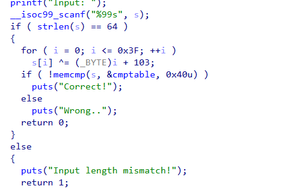
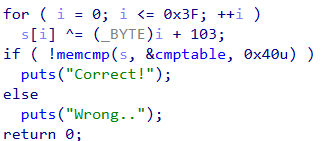

Challenge: Recover It!

Description: “My flag has gone by ransomware T.T. But hacker is dumb, i think.”

Flag format: hacktheon2026{correct_input}

After extracting the provided archive, we get a single ELF binary.

Basic checks:

Static Analysis (IDA pro)

We quickly identify the main logic:
+ Read user input
+ Validate length
+ Transform input
+ Compare with hardcoded table

1. Step 1 — Length Check

Decompiled code:

if (strlen(s) != 64){

    puts("Input length mismatch!");
    return;
}

=> Input must be exactly 64 bytes

2. Step 2 — Encryption Logic

Core transformation:

for (int i = 0; i < 0x40; i++) {

    input[i] ^= (i + 0x67);
}

=> Each byte is XORed with (index + 0x67)

3. Step 3 — Comparison

=> The transformed input must match cmptable

Exploitation Strategy
- We know: encoded[i] = input[i] ^ (i + 0x67)
- To recover original input: input[i] = encoded[i] ^ (i + 0x67)

=> XOR is reversible → just apply same operation again.

Extracting cmptable

Copy the bytes into a script.

Solve Script:

cmptable = [

    # paste extracted bytes here
    
]

res = []

for i in range(0x40):

    res.append(cmptable[i] ^ (i + 0x67))

print("FLAG:")

print(f"hacktheon2026{{{flag_input}}}")

