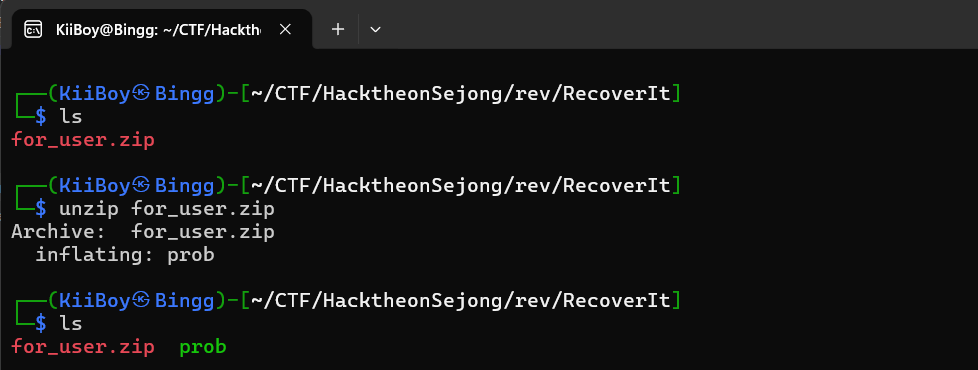
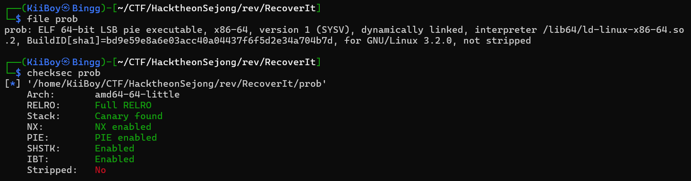
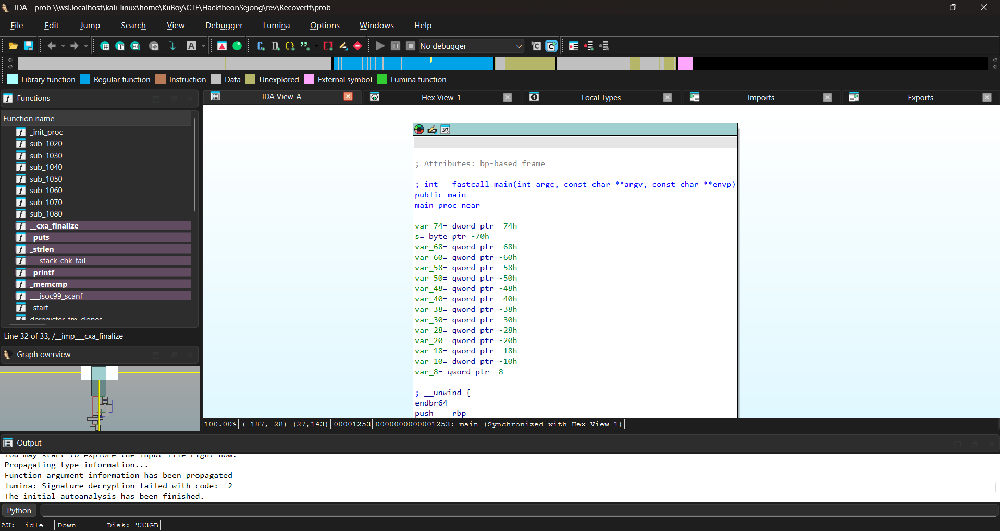
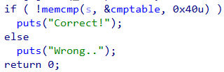
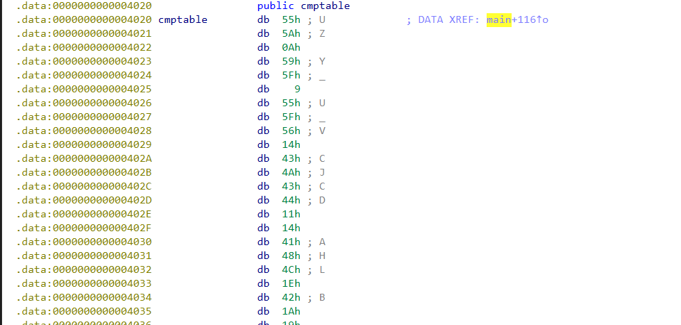
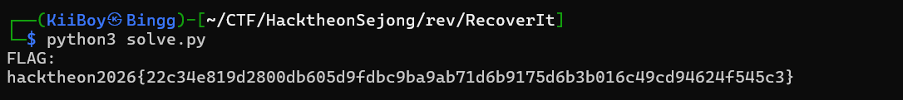

# Recover It!

## Description
“My flag has gone by ransomware T.T. But hacker is dumb, i think.”

## Analysis

After extracting the archive, we obtain a single ELF binary.


Basic checks:


Static Analysis (IDA pro)


The program:
- Reads user input
- Checks input length (must be 64 bytes)
- Applies XOR transformation
- Compares against a hardcoded table

### Length Check


Decompiled code:

```c
if (strlen(s) != 64){
    puts("Input length mismatch!");
    return;
}
```

=> Input must be exactly 64 bytes

### Encryption Logic


Core transformation:
```c
for (int i = 0; i < 0x40; i++) {
    input[i] ^= (i + 0x67);
}
```

=> Each byte is XORed with (index + 0x67)

### Comparison



=> The transformed input must match cmptable

Exploitation Strategy
- We know: encoded[i] = input[i] ^ (i + 0x67)
- To recover original input: input[i] = encoded[i] ^ (i + 0x67)

=> XOR is reversible → just apply same operation again.

Extracting cmptable



Solve Script:

```python
cmptable = [
    # paste bytes here
]

res = []

for i in range(0x40):
    res.append(cmptable[i] ^ (i + 0x67))

flag = ''.join(chr(c) for c in res)

print(f"hacktheon2026{{{flag}}}")
```



## 🏁 Flag

hacktheon2026{22c34e819d2800db605d9fdbc9ba9ab71d6b9175d6b3b016c49cd94624f545c3}
