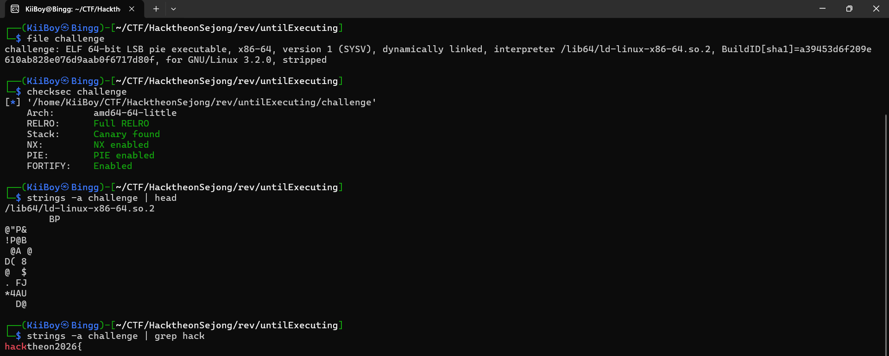
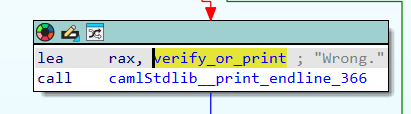
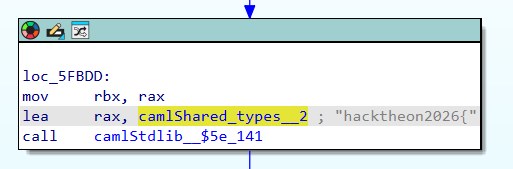
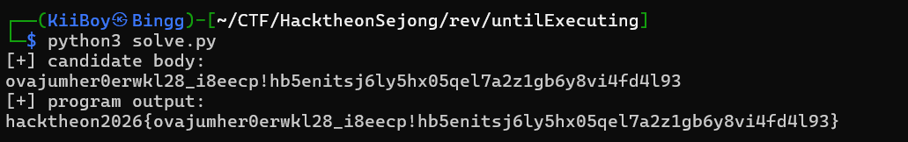

# Until Executing — Reverse Write-up (Pro Blog)

## Description: When does this even execute?

## Analysis
```bash
file challenge
checksec challenge
strings -a challenge | head
strings -a challenge | grep hack
strings -a challenge | grep hack
```


=> The flag is constructed from user input.

IDA Analysis

1. Locate failure path

Search "Wrong." in Strings.



2. Locate flag print

Find:

hacktheon2026{%s}



Input Constraints

Length: len(input) == 64

Charset: abcdefghijklmnopqrstuvwxyz_0123456789!

The Trick: Delayed Execution

Instead of validating immediately:

checker[i] = make_checker(...);


### Insight

Validation happens later, not during input parsing.

Execution Phase

```c
for (i = 0; i < n; i++) {
    if (!checker[i]()) fail();
}
```

Binary Type

Evidence suggests OCaml compiled binary:

closures everywhere

indirect calls

strange control flow

Two Verifiers

✔ Verifier B

constraint-based

solvable

✔ Verifier A

digest-based

opaque

### Strategy

Extract constraints from Verifier B

Solve to get candidates

Test against real binary

Constraint Example

(input[a] ^ input[b]) == k;

↓

(ord(s[a]) ^ ord(s[b])) == k

Solver Approach

DFS + pruning using partial constraints.

⚙️ Intermediate Result
ovajumher0erwkl28_i8ee...

### Solve Script:

```python
#!/usr/bin/env python3
import subprocess

BIN = "./challenge"
CHARSET = "abcdefghijklmnopqrstuvwxyz_0123456789!"
PREFIX = "hacktheon2026"

# Final reduced constraints recovered from the delayed checker chain.
# Format: position -> expected character
CHECKERS = {
    0:"o", 1:"v", 2:"a", 3:"j", 4:"u", 5:"m", 6:"h", 7:"e",
    8:"r", 9:"0", 10:"e", 11:"r", 12:"w", 13:"k", 14:"l", 15:"2",
    16:"8", 17:"_", 18:"i", 19:"8", 20:"e", 21:"e", 22:"c", 23:"p",
    24:"!", 25:"h", 26:"b", 27:"5", 28:"e", 29:"n", 30:"i", 31:"t",
    32:"s", 33:"j", 34:"6", 35:"l", 36:"y", 37:"5", 38:"h", 39:"x",
    40:"0", 41:"5", 42:"q", 43:"e", 44:"l", 45:"7", 46:"a", 47:"2",
    48:"z", 49:"1", 50:"g", 51:"b", 52:"6", 53:"y", 54:"8", 55:"v",
    56:"i", 57:"4", 58:"f", 59:"d", 60:"4", 61:"l", 62:"9", 63:"3",
}

def local_verify(s: str) -> bool:
    if len(s) != 64:
        return False
    if any(c not in CHARSET for c in s):
        return False
    for idx, expected in CHECKERS.items():
        if s[idx] != expected:
            return False
    return True

def build_candidate() -> str:
    out = ["?"] * 64
    for idx, ch in CHECKERS.items():
        out[idx] = ch
    return "".join(out)

def test_binary(candidate: str) -> str:
    p = subprocess.run(
        [BIN],
        input=(candidate + "\n").encode(),
        stdout=subprocess.PIPE,
        stderr=subprocess.PIPE,
    )
    return p.stdout.decode(errors="ignore")

def main():
    candidate = build_candidate()

    print("[+] candidate body:")
    print(candidate)

    assert local_verify(candidate), "local constraints failed"

    out = test_binary(candidate)
    print("[+] program output:")
    print(out)

    if PREFIX in out:
        print("[+] flag recovered")
    else:
        print("[-] candidate did not pass binary")

if __name__ == "__main__":
    main()
```



## 🏁 Flag

hacktheon2026{ovajumher0erwkl28_i8eecp!hb5enitsj6ly5hx05qel7a2z1gb6y8vi4fd4l93}